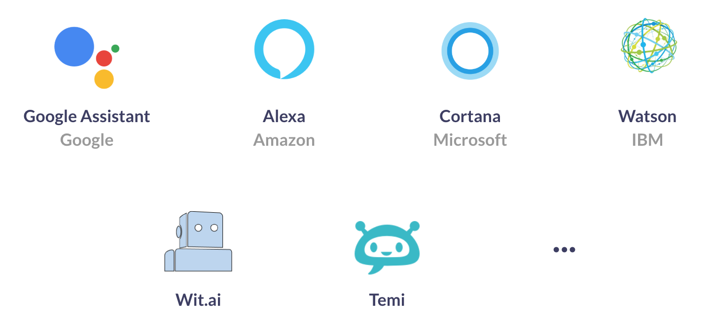

# 

|                   	     | TYPE  	| VERSION 	            | STATUS 	          | COVERAGE                |
|--------------------------- |:-------:	|---------------------- |-------------------- |:-----------------------:|
| `demo`                     | _demo_  	| ![Latest demo][v0]    | ![Build Status][s0] | ![Coverage Status][c0]  |
| `conversations-core`       | _core_  	| ![Latest version][v1] | ![Build Status][s1] | ![Coverage Status][c1]  |
| `addon-android-speech`     | _addon_ 	| ![Latest version][v2] | ![Build Status][s2] | ![Coverage Status][c2]  |
| `addon-google-speech`      | _addon_	| ![Latest version][v3] | ![Build Status][s3] | ![Coverage Status][c3]  |
| `addon-amazon-speech`      | _addon_	| ![Latest version][v4] | ![Build Status][s4] | ![Coverage Status][c4]  |


Check: [VUI SDK](https://github.com/chattylabs/voice-user-interaction)

This library combines both native built-in resources and cloud services into 
a software component capable to run reliably a **Speech Synthesizer** and a **Voice Recognizer**.

<br/>
<p align="center"></p>
<br/>

It enables currently the following providers:

- [Built-in Android][p1] (@FranRiadigos)
    - [TextToSpeech][p2]
    - [SpeechRecognizer][p3]
- [Google Cloud][p4] (@FranRiadigos)
    - [Text-To-Speech][p5]
    - [Speech-To-Text][p6]
- [Amazon][p4] (@xvelx)
    - [Polly][p5]
    - [Transcribe][p6]
    
Other providers you can contribute with are:

- _Microsoft Azure_ 
- _Watson (IBM)_
- _Wit.ai_
- _Temi_ 

## Why choosing this library?

Apart from the above mentioned, it also helps you when:
- some devices don't have configured the resources you need to run a conversation in your app
- a developer needs to learn and test quite a lot before even to start coding for voice capabilities
- noise is impacting considerably the communication
- oldest android components force you to create a lot of boilerplate
- some countries don't allow Google Services

    
## Prerequisites
The SDK works on Android version 5.0 (Lollipop) and above. _(for lower versions [contact us](mailto:hello@chattylabs.com))_

## Dependencies

    repositories { 
        
        // Optional. Access to early versions not yet published.
        maven { url "https://dl.bintray.com/chattylabs/maven" }
    }

    dependencies {

        // Required
        implementation 'chattylabs:conversations-core:<latest version>'
         
        // You can either use only one or combine addons
        // i.e. the Voice Recognizer of Google with the Synthesizer of Android
        implementation 'chattylabs:addon-android-speech:<latest version>'
        implementation 'chattylabs:addon-google-speech:<latest version>'
    }

## How to create a Conversation?

You can use the component at any [Context]() level, both in an [Activity]() and a [Service](). 
<br/>You will create a set of `VoiceNode` objects, add them into the graph and build a flow.

```kotlin
// Get the Component via default provider
val component = ConversationalFlow.provide(...)

// Setup the Addons to use (typically done in your Application class)
component.updateConfiguration(builder ->
        builder .setRecognizerServiceType(() -> AndroidSpeechRecognizer.class)
                .setSynthesizerServiceType(() -> AndroidSpeechSynthesizer.class)
                .build())

// To record from the mic you have to request the permissions
val perms = component.requiredPermissions()
// requestPermissions(perms)

// You should check if the addons are available
component.checkSpeechSynthesizerStatus(...)


val conversation: Conversation = component.create(context)
 
val question: VoiceMessage = ...
val answers: VoiceMatch = ...

with(conversation) {

    addNode(question)
    addNode(answers)
 
    with(prepare()) {

        from(question).to(answers)
    }
 
    start(question)
}
```

There are different [Voice Nodes]() and [Configurations](), check the [wiki page]()

&nbsp;

[v0]: https://img.shields.io/badge/demo-v0.6.3-blue.svg
[v1]: https://api.bintray.com/packages/chattylabs/maven/conversations-core/images/download.svg?label=Latest%20version
[v2]: https://api.bintray.com/packages/chattylabs/maven/addon-android-speech/images/download.svg?label=Latest%20version
[v3]: https://api.bintray.com/packages/chattylabs/maven/addon-google-speech/images/download.svg?label=Latest%20version
[v4]: https://api.bintray.com/packages/chattylabs/maven/addon-amazon-speech/images/download.svg?label=Latest%20version

[s0]: https://app.bitrise.io/app/140e33e4fa4ab888/status.svg?token=QxUVT4wZRj6JGkZb4zSVAA&branch=master
[s1]: https://app.bitrise.io/app/0967af538a0efcc5/status.svg?token=95j60AolkTmhbMvDK5zhFw&branch=master
[s2]: https://app.bitrise.io/app/b555517d495ac587/status.svg?token=Fa2M4c_F5YHkhPddufLCNA&branch=master
[s3]: https://app.bitrise.io/app/6a8c16b3b5c964a8/status.svg?token=Q6_u9joriJEzfzcWaLuVjg&branch=master
[s4]: https://app.bitrise.io/app/beb0060592365303/status.svg?token=Nn2JIfPDel5PkqA2vDkuWw&branch=master

[c0]: https://coveralls.io/repos/chattylabs/unknown/badge.svg?branch=master&service=github
[c1]: https://coveralls.io/repos/chattylabs/conversations-core/badge.svg?branch=master&service=github
[c2]: https://coveralls.io/repos/chattylabs/addon-android-speech/badge.svg?branch=master&service=github
[c3]: https://coveralls.io/repos/chattylabs/addon-google-speech/badge.svg?branch=master&service=github
[c4]: https://coveralls.io/repos/chattylabs/addon-amazon-speech/badge.svg?branch=master&service=github

[p1]: https://developers.google.com/voice-actions/interaction/voice-interactions
[p2]: https://developer.android.com/reference/android/speech/tts/TextToSpeech
[p3]: https://developer.android.com/reference/android/speech/SpeechRecognizer
[p4]: https://cloud.google.com/
[p5]: https://cloud.google.com/text-to-speech/
[p6]: https://cloud.google.com/speech-to-text/
